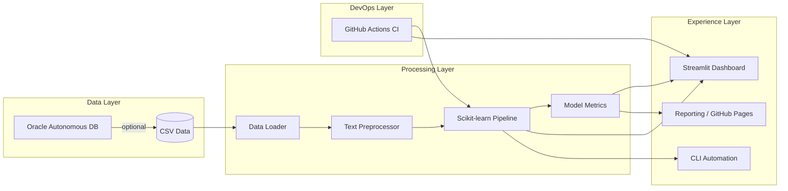

# 💼 Deloitte-Ready Twitter Sentiment Intelligence

A production-grade sentiment analysis accelerator designed to showcase the end-to-end delivery skills expected from a Deloitte India Oracle Analyst. The solution covers data ingestion, preprocessing, model training, governance, deployment readiness, and professional storytelling.


## 🧭 Why this project stands out

- **Oracle ecosystem alignment** – configurable ingestion from Oracle Autonomous Database, OCI deployment guide, and analytics workflows tailored for enterprise reporting.
- **Consulting-grade engineering** – modular Python package, logging, configuration management, and CI/CD automation.
- **Business storytelling** – dashboards, metrics, and documentation that translate technical outcomes into measurable value for stakeholders.

## 🔗 Live resources & quick links

| Asset | Purpose | Link |
| --- | --- | --- |
| **Live Streamlit demo** | Shareable dashboard URL for interviews (update after deployment) | [`https://<your-app>.streamlit.app`](https://<your-app>.streamlit.app) |
| **Architecture blueprint** | Deep dive on data, model, and DevOps layers | [`docs/architecture.md`](docs/architecture.md) |
| **OCI deployment playbook** | Container-first rollout with Oracle services | [`deployment/oracle_cloud.md`](deployment/oracle_cloud.md) |
| **Streamlit Community Cloud guide** | Launch a public URL in minutes | [`deployment/streamlit_cloud.md`](deployment/streamlit_cloud.md) |
| **Vercel redirect playbook** | Turn your Vercel domain into a Streamlit launcher | [`deployment/vercel_redirect.md`](deployment/vercel_redirect.md) |
| **GitHub connection & live check** | Step-by-step repo linking plus URL validation | [`deployment/github_live_validation.md`](deployment/github_live_validation.md) |
| **Training data sample** | Jump-start retraining conversations | [`data/twitter_training.csv`](data/twitter_training.csv) |

> ✅ Once you publish the Streamlit app, replace the placeholder domain above. The link will then be accessible from any device (mobile, tablet, or laptop) and can be embedded directly in your resume or interview slides.

## 🏗️ Architecture overview



## 📁 Repository structure

| Path | Description |
| --- | --- |
| `app/` | Streamlit application for stakeholder demos |
| `artifacts/` | Generated model artifacts (gitignored; create via `scripts/train.py` before first run) |
| `config/` | Centralised YAML configuration controlling ingestion, preprocessing, and deployment toggles (stored in JSON-compatible YAML for portability) |
| `data/` | Sample labelled tweets for local experimentation |
| `deployment/` | Cloud deployment runbooks (Oracle Cloud Infrastructure, Azure, AWS) |
| `docs/` | Architecture diagrams, KPI catalogue, and interview collateral |
| `scripts/` | Automation scripts for training and inference |
| `src/twitter_sentiment/` | Reusable Python package powering the pipeline |
| `tests/` | Pytest-based unit tests covering preprocessing and inference |
| `.github/workflows/` | CI workflow executing tests and lightweight linting |

## 🚀 Quick start

```bash
# 1. Create a virtual environment (recommended)
python -m venv .venv
source .venv/bin/activate  # Windows: .venv\Scripts\activate

# 2. Install dependencies
pip install --upgrade pip
pip install -r requirements.txt

# 3. Train the pipeline to generate fresh artifacts
python scripts/train.py

# 4. Launch the Deloitte storytelling dashboard
streamlit run app/app.py
```

> **Note:** Model artifacts are deliberately excluded from source control. Run `python scripts/train.py` (or `make train`) any time you clone the repo or reset the workspace so that `artifacts/sentiment_pipeline.joblib` is available for the app, CLI, and tests.

## 🧪 Quality gates

| Check | Command |
| --- | --- |
| Unit tests | `pytest -q` |
| Package sanity | `python -m compileall src` |
| Model retrain | `python scripts/train.py` |

GitHub Actions automatically executes tests and sanity checks on every push / PR against `main`.

## 🧩 Feature highlights

- Config-driven ingestion toggling between CSV and Oracle Autonomous Database.
- Reusable preprocessing component with whitespace, URL, mention, and punctuation handling.
- Scikit-learn pipeline persisted with evaluation metrics for auditability.
- Streamlit dashboard with business-friendly narrative, download-ready metrics, and governance tab.
- CLI utilities for automation workflows (`scripts/train.py`, `scripts/predict.py`).
- Unit tests and CI pipeline to demonstrate engineering rigor.

## ☁️ Deploy to the cloud

A detailed, step-by-step OCI deployment guide lives at [`deployment/oracle_cloud.md`](deployment/oracle_cloud.md). Highlights include:

1. Containerising the Streamlit app with OCI Container Instances.
2. Automating retraining via OCI Data Science jobs or GitHub Actions.
3. Wiring up Autonomous Database sources using wallet-based connectivity.

Need a fast public URL you can open from any phone? Follow the Streamlit Community Cloud steps in [`deployment/streamlit_cloud.md`](deployment/streamlit_cloud.md) and drop the generated link into the **Live resources** table above.

Once your link is live, update `live_app.streamlit_url` in [`config/settings.yaml`](config/settings.yaml) and run `make verify-live` (or invoke [`scripts/check_live_app.py`](scripts/check_live_app.py)) with no arguments. The command now reads the config value and confirms the dashboard responds with `200 OK` before interviews.

Need a vanity Vercel link for QR codes? Generate the redirect HTML via [`scripts/update_vercel_redirect.py`](scripts/update_vercel_redirect.py) and follow [`deployment/vercel_redirect.md`](deployment/vercel_redirect.md) to publish it.

Additional notes for Azure Web Apps and AWS App Runner are provided for multi-cloud discussions.

## 🗃️ Oracle database integration

Update [`config/settings.yaml`](config/settings.yaml) to toggle `oracle_integration.enabled` and supply wallet credentials. The data loader will then pull training data directly from the Autonomous Database using `oracledb`.

```yaml
oracle_integration:
  enabled: true
  wallet_location: /path/to/wallet
  user: DATA_ENGINEER
  dsn: myadb_high
  sql_query: |
    SELECT text, sentiment
    FROM analytics.twitter_training_data
    WHERE created_at >= SYSDATE - 30
```

## 📊 Storytelling in interviews

1. **Business impact** – emphasise how proactive sentiment tracking improves customer retention and campaign ROI.
2. **Oracle expertise** – discuss wallet-based connectivity, SQL data modelling, and how OCI services plug into the pipeline.
3. **Engineering excellence** – highlight modular package design, automated tests, and CI/CD.
4. **Consulting mindset** – walk through the Streamlit dashboard as an executive-ready deliverable with actionable insights.

## 📦 Publishing on GitHub

- Use feature branches for enhancements (`feature/oracle-ingestion`, `chore/ci-updates`).
- Raise Pull Requests with CI status checks and screenshots of the Streamlit UI.
- Leverage GitHub Projects to track backlog items (e.g., drift monitoring, Oracle APEX reporting).
- Tag releases (e.g., `v1.0.0`) once the model is retrained and deployment is live.

## 📣 Share the live demo

- Deploy the Streamlit container to OCI or Streamlit Community Cloud.
- Capture dashboard screenshots (`docs/screenshots/`) for the README and interview slide deck.
- Prepare a 3-minute walkthrough focusing on client scenario, data sources, and automation roadmap.

## 🤝 Contributing

Pull requests are welcome! Please open an issue describing the proposed enhancement or bug fix before submitting large changes.

---

Made with consulting rigour to help you shine in the Deloitte India Oracle Analyst interview.
