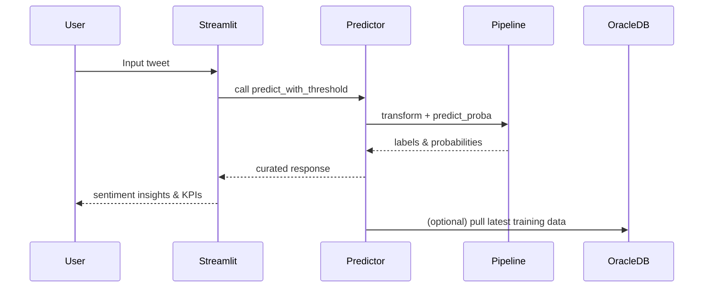

# Architecture & Solution Blueprint

## High-level flow

1. **Ingest**: CSV files for local dev, Oracle Autonomous Database for enterprise deployments.
2. **Process**: Config-driven preprocessing with reusable Python package.
3. **Model**: Scikit-learn pipeline with TF-IDF + Logistic Regression.
4. **Serve**: Streamlit dashboard and CLI automation.
5. **Operate**: GitHub Actions CI, retraining script, and OCI deployment path.

## Key metrics & KPIs

| KPI | Description | Target |
| --- | --- | --- |
| Macro F1 | Balanced view across positive/neutral/negative | ≥ 0.80 |
| Prediction latency | Streamlit inference response time | < 200 ms |
| Data freshness | Time since last Oracle sync | < 24 hours |
| Model drift PSI | Population stability index | < 0.2 |

## Extensibility roadmap

- Plug-in architecture for additional languages.
- OCI Data Science jobs for scheduled retraining.
- Oracle APEX dashboard embedding the Streamlit app.
- Integration with Deloitte's accelerators for risk & compliance logging.
